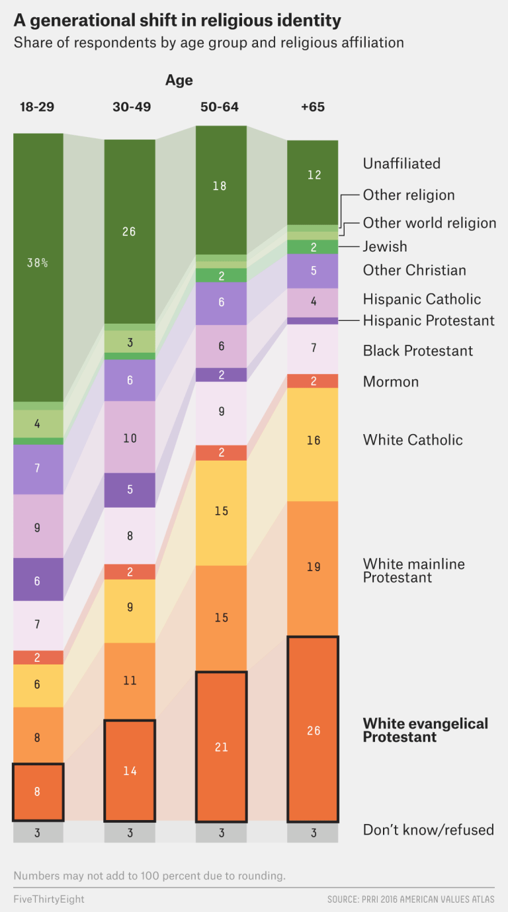

For this exercise, I'll try to recreate this figure from [FiveThirtyEight](https://fivethirtyeight.com/features/are-white-evangelicals-sacrificing-the-future-in-search-of-the-past/):

Now, I had to scroll quite a bit because there were definitely graphs I was interested in recreating for the fun of it but they either seemed too complicated or too I-will-never-need-to-make-this-kind-of-graph. However, I eventually stumbled onto this figure here which I learned is called an _alluvial_ plot. While stacked bars by themselves should be able to convey the same amount of information, I think this looks great and I'd like to learn how to make one. 

**Getting the Data**

Since the plot essentially provides the numbers, I went ahead and made the csv myself in Excel. 

```{r setup, warning=FALSE, message=FALSE}
library(tidyverse)
library(ggalluvial)
library(ggrepel)
library(here)

data_path <- here("presentation-exercise","presentation_data.csv") #using Here to set the path toward the data file

data <- read.csv2(data_path, sep = ",", header=TRUE) #reading in the data file

print(data) #taking a look at the data file
```

**AI Prompts**

Testing the extent of ChatGPT's capabilities, I uploaded the figure I want to recreate and a screenshot of my data.

_"I have data that looks like this. Can you help me recreate a figure in R that looks like this?"_

Just for reference, here is the immediate code it provided and what the first draft of our figure looks like:
```{r}
# ---- example: read your data ----
# Your data should have: age_group, religion, percent
# df <- read_csv("your_file.csv")

# If you already have df in memory, just ensure these columns exist:
# df: age_group (e.g., "18-29","30-49","50-64","+65"), religion, percent (numeric)

data <- data %>%
  mutate(
    age_group = as.character(age_group),
    percent   = as.numeric(percent)
  )

# ---- control the order of bars and stack order ----
age_levels <- c("18-29", "30-49", "50-64", "+65")

religion_levels <- c(
  "Unaffiliated",
  "Other religion",
  "Other world Religion",
  "Jewish",
  "Other Christian",
  "Hispanic Catholic",
  "Hispanic Protestant",
  "Black Protestant",
  "Mormon",
  "White Catholic",
  "White mainline Protestant",
  "White evangelical Protestant",
  "Don't know/refused"
)

data <- data %>%
  mutate(
    age_group = factor(age_group, levels = age_levels),
    religion  = factor(religion,  levels = religion_levels)
  )

# ---- plot ----
p <- ggplot(
  data,
  aes(
    x = age_group,
    stratum  = religion,
    alluvium = religion,   # ribbons connect same religion across ages
    y = percent,
    fill = religion
  )
) +
  geom_alluvium(alpha = 0.25, color = NA, width = 0.35) +  # the "trails"
  geom_stratum(width = 0.35, color = NA) +                 # the stacked bars
  # inside labels (only for bigger segments)
  geom_text(
    stat = "stratum",
    aes(label = ifelse(after_stat(y) >= 4, round(after_stat(y)), "")),
    color = "white",
    size = 3
  ) +
  scale_x_discrete(position = "top") +
  scale_y_continuous(expand = c(0, 0), limits = c(0, 100)) +
  guides(fill = "none") +
  theme_minimal(base_size = 12) +
  theme(
    panel.grid.major.x = element_blank(),
    panel.grid.minor = element_blank(),
    axis.title = element_blank(),
    axis.text.y = element_blank(),
    axis.ticks = element_blank()
  )
  
last_age <- tail(levels(data$age_group), 1)

lab_df <- data %>%
  filter(age_group == last_age) %>%
  arrange(religion) %>%
  mutate(y_center = cumsum(percent) - percent/2)

p +
  geom_text_repel(
    data = lab_df,
    aes(x = age_group, y = y_center, label = religion),
    nudge_x = 0.6,
    direction = "y",
    hjust = 0,
    segment.size = 0.3,
    size = 3,
    inherit.aes = FALSE
  ) +
  coord_cartesian(clip = "off") +
  theme(plot.margin = margin(10, 120, 10, 10))
```

It's definitely not exactly like the figure I'm trying to recreate but it's not a bad place to start. Off the bat, there are things I want to change:
 
  1. It did alright with putting the age groups on top of the bars for most of them, but not for the last bar (it should say "+65").
 
  2. Instead of placing the individual numbers in the bar sections, it looks like this figure might be adding them up toward the top.
 
  3. It doesn't label the sections by religion on the right. 
 
  4. We'll try to recreate the colors as best as we can as well.
 
  5. If I have time/patience, I'll see if I can make the transition design elements between the bars straight instead of wavy.

From here, I'll go over each line of code the AI provided and see where it got right or wrong. I'm documenting in this section what corrections I had to do:

  1. I found that the original data and the AI-transformed data looked different because it was using variable entry names that the original figure had but not my dataset (e.g., In the original figure, the age group is "+65" but in my recreated dataset, it's just "65").

  2. 

**My Recreation**
After some back and forth with AI and my own troubleshooting, here is what I came up with.
```{r}

#read data
df <- read.csv(data_path)

# --- 2) Factor order (bottom -> top in the ORIGINAL figure)
age_levels <- c("18-29", "30-49", "50-64", "+65")

religion_levels_bottom_to_top <- c(
  "Don't know",
  "White evangelical Protestant",
  "White mainline Protestant",
  "White Catholic",
  "Mormon",
  "Black Protestant",
  "Hispanic Protestant",
  "Hispanic Catholic",
  "Other Christian",
  "Jewish",
  "Other world Religion",
  "Other religion",
  "Unaffiliated"
)

# IMPORTANT:
# In your plots, ggalluvial is drawing the FIRST factor level at the TOP.
# So we reverse the levels so that "Unaffiliated" ends up on TOP and "Don't know" on BOTTOM.
df2 <- df %>%
  mutate(
    age_group = as.character(age_group),
    age_group = stringr::str_trim(age_group),
    age_group = dplyr::recode(age_group, "65" = "+65"),  # safer than if_else
    age_group = factor(age_group, levels = age_levels, ordered = TRUE),

    religion = as.character(religion),
    religion = stringr::str_trim(religion),
    religion = factor(religion, levels = rev(religion_levels_bottom_to_top)),

    percent = as.numeric(percent)
  )

# --- 3) Colors (edit hex codes if desired) ---
religion_cols <- c(
  "Unaffiliated"                = "#557A2E",
  "Other religion"              = "#A9C98B",
  "Other world Religion"        = "#CFE0C0",
  "Jewish"                      = "#7BC96F",
  "Other Christian"             = "#9B7FD0",
  "Hispanic Catholic"           = "#D9B5D8",
  "Hispanic Protestant"         = "#7A5AAE",
  "Black Protestant"            = "#F2EAF6",
  "Mormon"                      = "#EA6A4A",
  "White Catholic"              = "#F6D36B",
  "White mainline Protestant"   = "#F39A4A",
  "White evangelical Protestant"= "#EB6E3A",
  "Don't know"                  = "#BDBDBD"
)

# --- 4) Compute label midpoints using YOUR values ---
# We compute midpoints in the same vertical stacking order (bottom -> top).
# Since we reversed religion levels above, "bottom -> top" is just arrange(desc(religion)).
lab_inside <- df2 %>%
  group_by(age_group) %>%
  arrange(desc(religion), .by_group = TRUE) %>%     # bottom -> top stacking order
  mutate(y_mid = cumsum(percent) - percent/2) %>%
  ungroup()

lab_right <- lab_inside %>% filter(age_group == "+65")

# --- 5) Plot ---
p <- ggplot(
  df2,
  aes(
    x        = age_group,
    stratum  = religion,
    alluvium = religion,
    y        = percent,
    fill     = religion
  )
) +
  # ribbons (straight)
  geom_alluvium(alpha = 0.18, width = 0.35, curve_type = "linear", color = NA) +
  
  # stacked bars
  geom_stratum(width = 0.35, color = "white", linewidth = 0.3) +
  
  # inside numbers (YOUR actual percent values)
  geom_text(
    data = lab_inside,
    aes(x = age_group, y = y_mid, label = ifelse(percent < 2, "", round(percent))),
    inherit.aes = FALSE,
    size = 3,
    color = "black"
  ) +
  
  # right-side labels (aligned to last bar strata)
  geom_text(
    data = lab_right,
    aes(x = age_group, y = y_mid, label = religion),
    inherit.aes = FALSE,
    hjust = 0,
    nudge_x = 0.45,
    size = 4,
    color = "black"
  ) +
  
  scale_fill_manual(values = religion_cols, drop = FALSE) +
  scale_x_discrete(
  limits = age_levels,          # <-- THIS forces the order even if factor breaks
  position = "top",
  expand = expansion(mult = c(0.06, 0.40))
)+
  coord_cartesian(clip = "off") +
  labs(
    title = "A generational shift in religious identity",
    subtitle = "Share of respondents by age group and religious affiliation",
    x = "Age",
    y = NULL
  ) +
  theme_minimal(base_size = 12) +
  theme(
    panel.grid = element_blank(),
    axis.text.y = element_blank(),
    axis.ticks.y = element_blank(),
    legend.position = "none",
    plot.margin = margin(10, 120, 10, 10)
  )

p

```

For comparison, the original:


I admit, there's one glaring part of the figure I haven't figured out. 

Here is a cute little table though.

```{r}
library(gt)
library(dplyr)
library(scales)
library(gtExtras)
library(svglite)
library(tidyverse)

tab_wide <- df2 %>%
  mutate(age_group = as.character(age_group)) %>%
  select(religion, age_group, percent) %>%
  pivot_wider(
    names_from = age_group,
    values_from = percent
  ) %>%
  # optional: order religions top->bottom like your plot
  arrange(factor(religion, levels = rev(religion_levels_bottom_to_top)))

gt_tbl <- tab_wide %>%
  gt(rowname_col = "religion") %>%
  tab_header(
    title = md("**A generational shift in religious identity**"),
    subtitle = "Share of respondents by age group and religious affiliation"
  ) %>%
  cols_label(
    `18-29` = "18–29",
    `30-49` = "30–49",
    `50-64` = "50–64",
    `+65`   = "65+"
  ) %>%
  fmt_number(
    columns = c(`18-29`, `30-49`, `50-64`, `+65`),
    decimals = 0
  ) %>%
  # light “heatmap” shading to make patterns pop
  data_color(
    columns = c(`18-29`, `30-49`, `50-64`, `+65`),
    colors = scales::col_numeric(
      palette = c("#f5f5f5", "#d9e4d1", "#557A2E"),
      domain = NULL
    )
  ) %>%
  tab_style(
    style = cell_text(weight = "bold"),
    locations = cells_column_labels(everything())
  ) %>%
  tab_options(
    table.font.names = "Arial",
    table.font.size = 12,
    row_group.font.weight = "bold",
    data_row.padding = px(5),
    heading.align = "left"
  ) %>%
  tab_source_note(md("Values are percentages; totals may not equal 100 due to rounding."))

gt_tbl
```


But when I tried adding a trendline, it ceased to be the cute little table I've grown to love.

```{r}
age_cols <- c("18-29", "30-49", "50-64", "+65")

# --- Build wide table + sparkline list-column ---
tab_wide <- df2 %>%
  mutate(age_group = as.character(age_group)) %>%
  select(religion, age_group, percent) %>%
  pivot_wider(names_from = age_group, values_from = percent) %>%
  # order to match your plot (Unaffiliated at top, Don't know at bottom)
  arrange(factor(religion, levels = rev(religion_levels_bottom_to_top))) %>%
  # list-column used by gtExtras sparklines
  mutate(Trend = pmap(select(., all_of(age_cols)), c)) %>%
  # put Trend right after the stub
  select(religion, Trend, all_of(age_cols))

# --- Make the gt table (compact version) ---
gt_tbl <- tab_wide %>%
  gt(rowname_col = "religion") %>%
  tab_header(
    title = md("**A generational shift in religious identity**"),
    subtitle = "Share of respondents by age group and religious affiliation"
  ) %>%
  cols_label(
    Trend  = "Trend",
    `18-29` = "18–29",
    `30-49` = "30–49",
    `50-64` = "50–64",
    `+65`   = "65+"
  ) %>%
  # smaller sparklines so the table doesn't balloon
  gt_plt_sparkline(
    column = Trend,
    same_limit = TRUE,
    fig_dim = c(55, 12)
  ) %>%
  fmt_number(columns = all_of(age_cols), decimals = 0) %>%
  # subtle heatmap shading like your first table
  data_color(
    columns = all_of(age_cols),
    colors = scales::col_numeric(
      palette = c("#f5f5f5", "#d9e4d1", "#557A2E"),
      domain = NULL
    )
  ) %>%
  tab_style(
    style = cell_text(weight = "bold"),
    locations = cells_column_labels(everything())
  ) %>%
  # compact widths (stub is the religion names)
  cols_width(
    stub() ~ px(200),
    Trend ~ px(85),
    everything() ~ px(60)
  ) %>%
  tab_options(
    table.width = pct(100),
    table.font.names = "Arial",
    table.font.size = 11,
    data_row.padding = px(2),
    heading.align = "left"
  ) %>%
  tab_source_note(md("Values are percentages; totals may not equal 100 due to rounding."))

gt_tbl
```